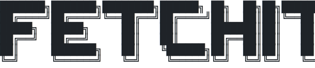
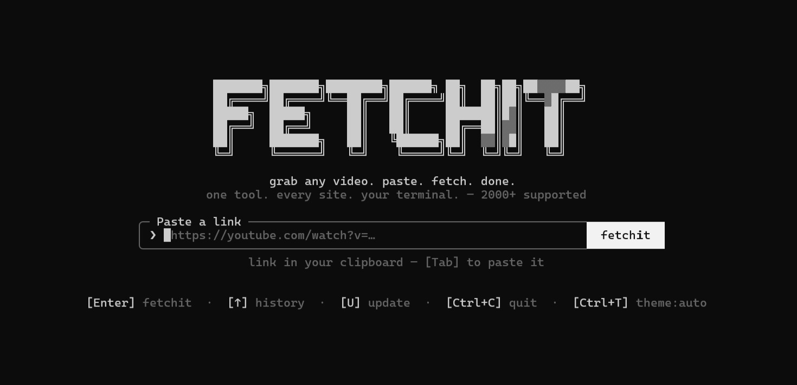
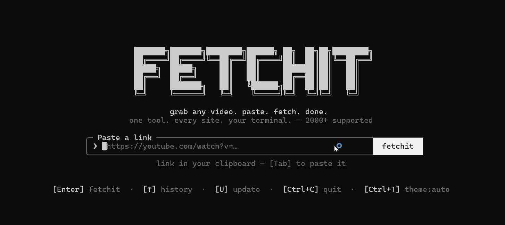
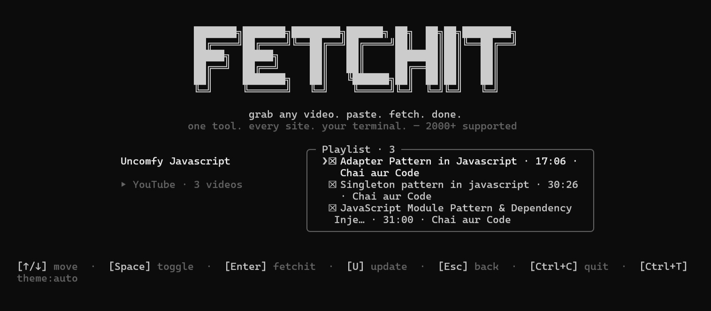

<div align="center">
  <picture>
    <source media="(prefers-color-scheme: dark)" srcset="assets/logo-dark.svg">
    
  </picture>

  <h3>grab any video. paste. fetch. done.</h3>

  <p>one tool. every site. your terminal. — 2000+ supported</p>

  <p>
    <a href="https://www.npmjs.com/package/@vedant1521/fetchit"></a>
    <a href="https://www.npmjs.com/package/@vedant1521/fetchit"></a>
    <a href="https://github.com/Vedant1521/fetchit/blob/main/LICENSE"></a>
    
    
    
  </p>
</div>

---

Download videos from **YouTube, X/Twitter, Instagram, Threads, TikTok** and
1,800+ other sites — right from your terminal. Paste a url, pick a
resolution (or audio-only mp3), done. No popups, no fake download buttons,
no sketchy redirects.

<div align="center">
  
</div>

<div align="center">
  
</div>

## ✨ Features

- **one command, every site** — a single `fetchit <url>` covers anything
  yt-dlp understands (2,000+ extractors). YouTube, X, Instagram, Threads,
  TikTok, Vimeo, Twitch, Reddit, Facebook and more are recognized by host
  and labeled in the UI.
- **pick a resolution, see the size first** — the format list shows each
  option with an estimated file size computed from the real format
  metadata, so you know whether 1080p is a 50 MB or a 500 MB download
  before you hit enter. Resolutions are capped at 8 entries to keep the
  picker tidy.
- **audio-only mp3** — extract the audio track at best quality
  (`--audio-quality 0`) with one option, no extra flags.
- **honest sizes** — the format_id you sized the label from is the
  exact one downloaded, so the label never lies. If a cached media url
  has expired and yt-dlp re-extracts, a height-bounded fallback selector
  keeps the download from escaping your cap (no surprise 4K pulls).
- **full-screen TUI** — takes over the terminal, centers everything,
  and restores your scrollback on exit. Resizes live with the window.
- **mouse + keyboard** — click the fetchit button, the format list, the
  footer hints, or the logo (takes you home). Or drive it entirely from
  the keyboard with readline-style editing.
- **three themes** — `auto` follows your terminal's own colors (light
  or dark), or force `light` / `dark`. Cycle live with `[Ctrl+T]`.
- **clipboard-aware** — launch bare and fetchit notices when your
  clipboard already holds a link; `[Tab]` pastes it, `[Enter]` fetches it.
- **url history** — last 50 links are recalled with `[↑]` / `[↓]` and
  stored at `~/.config/fetchit/history.json`.
- **zero Python, zero manual setup** — the standalone yt-dlp binary is
  fetched on first run; ffmpeg is found on your PATH with a bundled
  fallback. Nothing else to install.
- **scriptable mode** — `fetchit --best <url>` / `fetchit --mp3 <url>`
  skip the picker entirely and download directly, no terminal takeover.
  Pair with `-o <dir>` to point the output anywhere. Built for shell
  scripts, cron jobs, and CI pipelines.
- **chapters & time ranges** — `--chapters` embeds YouTube chapter markers
  into the file (view in VLC: right-click → Playback → Chapter; Windows
  Media Player doesn't support them), and `--from`/`--to` download just a
  clip from a long video. Toggle both live in the picker with `[C]` and
  `[T]`.
- **parallel playlist downloads** — playlist items download 3 at a time
  instead of one-by-one, cutting a 12-video playlist from ~30 min to
  ~10 min. The progress UI shows all active bars at once. YouTube is
  auto-sequential (it throttles parallel streams); override with
  `--concurrency N`.
- **cookie authentication** — `--cookies-from-browser firefox <url>` passes
  your browser cookies to yt-dlp for age-restricted or bot-checked videos.
  Inside the TUI, press `[B]` on the error screen to pick a browser and
  retry without leaving fetchit. On Windows, use Firefox (Chrome and Edge
  encrypt their cookies — see [Troubleshooting](./docs/troubleshooting.md)).
- **self-update** — `fetchit update` updates the bundled yt-dlp binary in
  place, or press `[U]` inside the TUI. The one-command fix for when
  downloads stop working because yt-dlp is stale.

## 📚 Documentation

New to fetchit? Start with the **[Getting Started](./docs/getting-started.md)**
guide — it walks you through install, your first download, and where files go.

For everything else, there's a dedicated guide:

| Guide | What's inside |
| --- | --- |
| [Getting Started](./docs/getting-started.md) | Install, first run, your first download, quick reference |
| [Interactive Mode](./docs/interactive-mode.md) | Full-screen TUI, every keyboard shortcut, mouse, themes, clipboard, history |
| [Scriptable Mode](./docs/scriptable-mode.md) | `--best` / `--mp3` / direct quality, `-o`, exit codes, scripting examples |
| [Playlists](./docs/playlists.md) | Playlist detection, multi-select picker, batch downloads, output structure |
| [Troubleshooting](./docs/troubleshooting.md) | Common errors, updating yt-dlp, ffmpeg issues, platform notes |

## 📺 Supported platforms

Fetchit labels the source automatically from the url host. Anything not
listed below still works — it just shows as the bare hostname.

| Host | Label |
| --- | --- |
| `youtube.com`, `youtu.be`, `music.youtube.com` | YouTube |
| `x.com`, `twitter.com` | X / Twitter |
| `instagram.com` | Instagram |
| `threads.net`, `threads.com` | Threads |
| `tiktok.com` | TikTok |
| `vimeo.com` | Vimeo |
| `twitch.tv` | Twitch |
| `reddit.com` | Reddit |
| `facebook.com`, `fb.watch` | Facebook |
| _…and 1,800+ more via yt-dlp_ | _your hostname_ |

## Install

```sh
npm install -g @vedant1521/fetchit
```

Or try it without installing anything:

```sh
npx @vedant1521/fetchit
```

Requires Node 18+. Everything else (yt-dlp, ffmpeg) is fetched or bundled
automatically.

## Usage

```sh
$ fetchit https://youtu.be/dQw4w9WgXcQ    # straight to the format picker
$ fetchit                                 # prompts for a url
$ fetchit --theme light                   # force the light palette
$ fetchit update                          # update the bundled yt-dlp binary
```

fetchit takes over the terminal (full-screen, centered — and restores your
scrollback on exit). Pick a format with `[↑]`/`[↓]` (or `j`/`k`, or number keys)
and hit enter. `[Esc]` goes back, `[Ctrl+C]` quits. Or just use the mouse — the
fetchit button, the format list and the footer hints are all clickable, and
clicking the logo takes you back home. Files are saved to `~/Downloads`,
and the file path is printed to your terminal when you're done.

### Keeping yt-dlp up to date

yt-dlp updates frequently (sometimes weekly) because sites keep changing
their layout. If downloads start failing, the fix is almost always to
update yt-dlp. If fetchit downloaded yt-dlp for you (most users), run:

```sh
fetchit update
```

This runs `yt-dlp -U` on the bundled binary at `~/.fetchit/bin/yt-dlp` and
prints the new version. If you have yt-dlp installed system-wide (via pip,
brew, or winget), fetchit tells you to update it through your package
manager instead — it can't update a system install.

<div align="center">
  
</div>

### Scriptable mode (no picker)

For scripts, cron jobs, and pipes — skip the interactive picker entirely
and download directly. No terminal takeover, no React, just a one-line
result. Works in any CI or shell pipeline.

```sh
$ fetchit --best https://youtu.be/…           # best quality, straight to download
$ fetchit --mp3 https://youtu.be/…            # audio-only mp3, straight to download
$ fetchit https://youtu.be/… 1080p            # direct quality — pick a resolution
$ fetchit https://youtu.be/… mp3              # same as --mp3, positional form
$ fetchit https://youtu.be/… 720p -o ~/Videos # save into ~/Videos instead
$ fetchit --best -o ~/Videos https://youtu.be/…  # flags + positional together
$ fetchit --chapters https://youtu.be/…       # best quality + chapter markers
$ fetchit --best --from 5:30 --to 10:15 https://youtu.be/…   # download a clip
```

`--best` and `--mp3` are mutually exclusive and both require a url. The
direct quality form takes a second positional: any resolution the video
offers (`1080p`, `720p`, `360p`, `144p`, …) or `mp3` / `audio`. They
auto-detect playlists (same as interactive mode) and download every item
into `~/Downloads/<playlist title>/` (or your `-o` dir). Progress is
printed as dots so the output stays pipe-friendly — `.` per progress tick,
`|` when merging/extracting.

`--chapters`, `--from`, and `--to` also trigger scriptable mode — they
download at **best quality** by default, so pair them with a quality or
`--best`/`--mp3` to choose something else. `--chapters` embeds YouTube
chapter markers into the output file (requires ffmpeg, and the video must
have chapters set by its creator). `--from` and `--to` download only a time
range — accept `MM:SS` or `HH:MM:SS` and can be used together or
individually (`--from 5:30` downloads from 5:30 to the end). Note:
time-range downloads need a system ffmpeg; the bundled fallback may not
support section splitting.

### Options

| Flag | Description |
| --- | --- |
| `[url]` | a video link to fetch immediately; skipped if omitted |
| `[quality]` | a resolution like `1080p`/`720p`/`360p`, or `mp3`/`audio` (scriptable) |
| `--best` | scriptable: download best quality, no picker (requires url) |
| `--mp3` | scriptable: download audio-only mp3, no picker (requires url) |
| `--chapters` | embed YouTube chapter markers into the output file |
| `--from <time>` | download from this point (`MM:SS` or `HH:MM:SS`) |
| `--to <time>` | download up to this point (`MM:SS` or `HH:MM:SS`) |
| `--concurrency <n>` | parallel playlist downloads (default 3; YouTube auto-sequential) |
| `--cookies-from-browser <browser>` | use browser cookies for authenticated downloads (chrome, firefox, edge, safari, brave) |
| `-o`, `--output <dir>` | save into `<dir>` instead of `~/Downloads` |
| `--theme <mode>` | start in `auto`, `light`, or `dark` for this run |
| `--theme=<mode>` | equals form, useful after the url |
| `-h`, `--help` | show help |
| `-v`, `--version` | show version |

## ⌨️ Keyboard reference

| Key | Action |
| --- | --- |
| `[Enter]` | fetchit (from the url field or the format picker) |
| `[↑]` / `[↓]` | choose a format, or recall url history in the input |
| `[Esc]` | back / cancel the current probe or download |
| `[Ctrl+C]` | quit |
| `[Ctrl+T]` | cycle theme: `auto` → `light` → `dark` → `auto` |
| `[Tab]` | paste a link detected in your clipboard |
| `[C]` | toggle chapter embedding (in the format picker) |
| `[T]` | edit a time range to download a clip (in the format picker) |
| `[U]` | update the bundled yt-dlp binary (from any non-busy phase) |

The url field is a full readline-style editor:

| Key | Action |
| --- | --- |
| `[Ctrl+A]` / `[Ctrl+E]` | jump to start / end |
| `[Alt+←]` / `[Alt+→]` (or `[Alt+B]` / `[Alt+F]`) | jump back / forward one word |
| `[Alt+Backspace]` / `[Ctrl+W]` | delete one word back |
| `[Ctrl+U]` / `[Ctrl+K]` | delete to start / end of line |
| `[Shift+←]` / `[Shift+→]` | extend the selection |
| `[Backspace]` / `[Delete]` | delete one char back / forward |

Pasting a full url into an empty field submits it automatically.

## 🖱️ Mouse

While fetchit is running, left-button presses are reported (your
terminal's native text selection needs a modifier key — option or shift).
Clickable regions: the **fetchit** button, every format row, each footer
hint, the theme control, and the **logo** (click to go home / cancel).

## 🎨 Themes

The default `auto` theme uses your terminal's own foreground and
background, so it follows light and dark terminal themes without guessing.
Press `[Ctrl+T]` or click the theme control in the footer to cycle through
`auto`, `light`, and `dark` for the current session. Use `--theme auto`,
`--theme light`, or `--theme dark` to choose the starting theme for one
launch.

## How it works

- Powered by [yt-dlp](https://github.com/yt-dlp/yt-dlp). On first run,
  fetchit downloads the standalone yt-dlp binary to `~/.fetchit/bin` —
  no Python required. If you already have yt-dlp installed, it uses yours.
- ffmpeg (needed for merging high-res streams and mp3 extraction) is found
  on your PATH, with `ffmpeg-static` as a bundled fallback.
- The probe step caches yt-dlp's `-J` metadata to a temp file so the
  download starts immediately via `--load-info-json` instead of
  re-extracting. If a cached media url has expired, fetchit transparently
  retries with a fresh extraction.
- The UI is [Ink](https://github.com/vadimdemedes/ink) — React for the
  terminal.

## 🛠️ Tech stack

| Layer | Choice |
| --- | --- |
| Language | [TypeScript](https://www.typescriptlang.org/) (strict) |
| TUI framework | [Ink](https://github.com/vadimdemedes/ink) — React in the terminal |
| UI runtime | [React 19](https://react.dev/) |
| Download engine | [yt-dlp](https://github.com/yt-dlp/yt-dlp) (standalone binary, auto-fetched) |
| Media processing | [ffmpeg](https://ffmpeg.org/) via [ffmpeg-static](https://www.npmjs.com/package/ffmpeg-static) fallback |
| Bundler | [tsup](https://tsup.etsy.com/) (esm, node18 target) |
| Test runner | Node's built-in `node:test` + `node:assert` |
| Package manager | npm |

## Development

```sh
npm install
npm run build        # bundle to dist/ with tsup
npm run dev          # rebuild on change
node dist/cli.js <url>
npm run typecheck    # tsc --noEmit
npm test             # tsx --test src/**/*.test.ts
```

To try it as a global command without publishing: `npm link`, then run
`fetchit` anywhere.

## Roadmap

- [x] `--best` / `--mp3` flags to skip the picker (scriptable mode)
- [x] `-o <dir>` to choose the output folder
- [x] Playlist / thread-with-multiple-videos support
- [x] Clipboard detection: launch bare and auto-suggest the url you copied
- [x] Self-update for the bundled yt-dlp binary (`fetchit update`)
- [x] Publish to npm (`npm i -g @vedant1521/fetchit` / `npx @vedant1521/fetchit`)
- [ ] `curl fetchit.sh | sh` installer

## A note on fair use

fetchit is a personal-archiving tool. Downloading content may violate a
platform's terms of service — only download what you have the right to
keep, and be excellent to creators.

## License

[MIT](LICENSE) © Vedant Gupta
